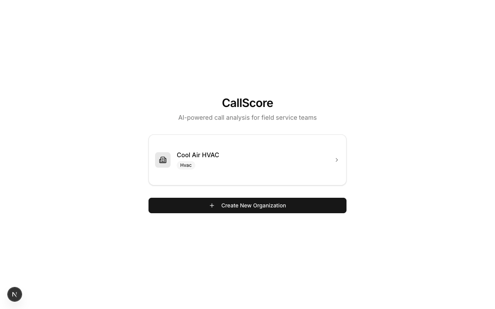
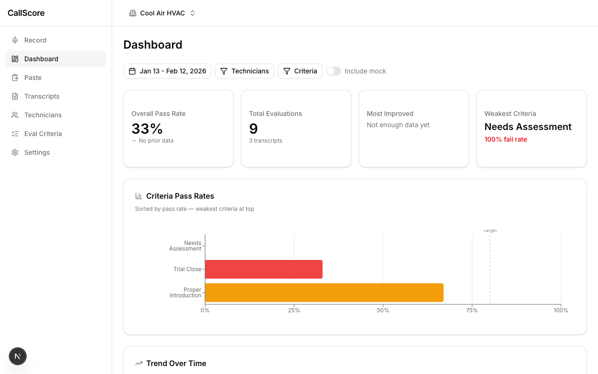
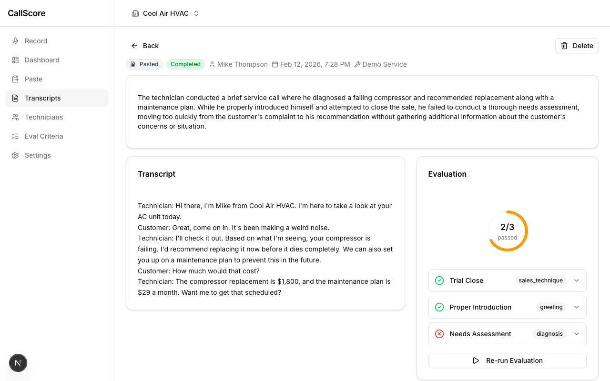
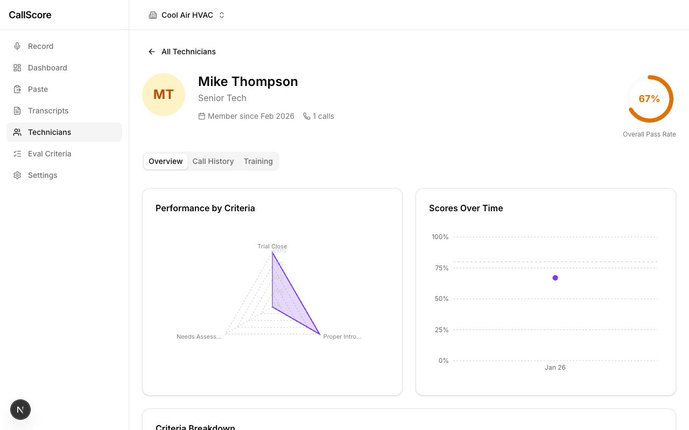
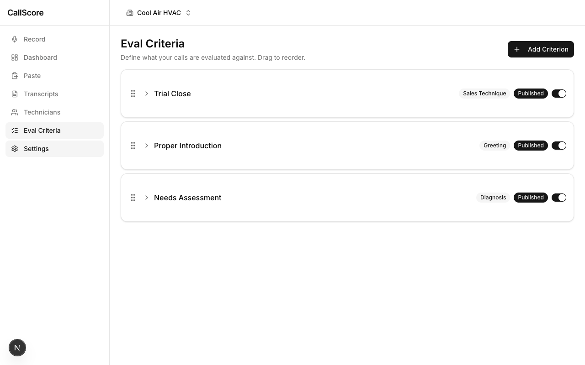
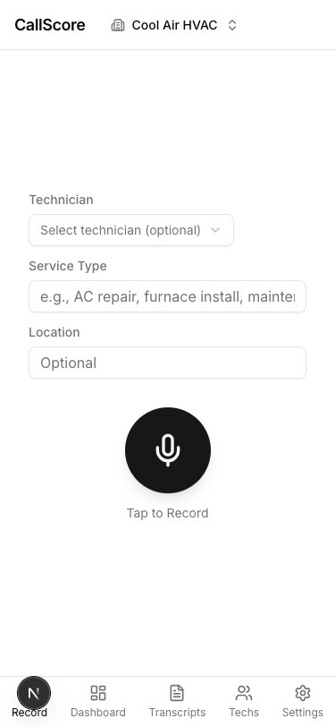
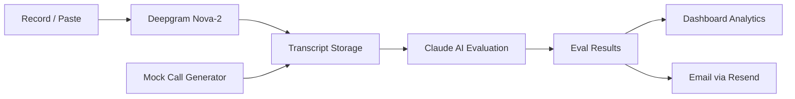

<p align="center">
  
</p>

<h1 align="center">CallScore</h1>

<p align="center">
  <strong>AI-powered call analysis for field service companies</strong>
</p>

<p align="center">
  Record technician sales calls, transcribe them with Deepgram, and evaluate performance against configurable criteria using Claude AI. Managers get dashboards with heatmaps and trend analysis. Technicians get mock call training.
</p>

<p align="center">
  <a href="https://fp-callscore.vercel.app">Live Demo</a>
</p>

<p align="center">
  
  
  
  
  
  
  
</p>

---

## Screenshots

### Landing Page

*Organization selector — click to enter, or create a new org with the onboarding wizard*

### Dashboard

*Manager dashboard with KPI cards, criteria pass rate chart, trend analysis, and filterable date ranges*

### Transcript Evaluation

*Split-panel view: transcript on the left, pass/fail eval results with circular score indicator on the right*

### Recording Interface

*One-tap recording with technician assignment, service type, and location metadata*

### Technician Profile

*Radar chart showing per-criteria performance, scores over time, and criteria breakdown*

### Eval Criteria Settings

*Drag-to-reorder evaluation criteria with category badges, published/draft status, and active toggles*

### Mobile View

*Responsive mobile layout with bottom navigation and touch-optimized recording button*

---

## Features

### Core
- **Call Recording** — Record sales calls directly in the browser with real-time waveform visualization. Supports WebM (Chrome/Firefox) and MP4 (Safari).
- **Paste Transcripts** — Import existing call transcripts for instant AI analysis.
- **AI Evaluation** — Claude evaluates each call against configurable criteria with pass/fail verdicts, confidence scores, detailed reasoning, and transcript excerpt evidence.
- **Re-run Evaluations** — Re-evaluate transcripts when criteria change, with 4 scope options (single, all pending, all for technician, all for org).

### Analytics
- **Manager Dashboard** — Heatmap showing technician x criteria pass rates, KPI cards with sparklines, trend charts with weekly/monthly bucketing, and a "needs attention" list.
- **Technician Profiles** — Radar chart across all criteria, monthly performance trend line, and per-technician call history with drill-down.
- **Filterable Analytics** — Filter by date range, technician, and source type. URL-based filter state for shareable links.

### Training & Notifications
- **Mock Call Generation** — AI-generated practice calls with industry-specific scenarios. Auto-evaluated after generation.
- **Email Notifications** — Branded eval summary emails via Resend after each analysis, sent to multiple configurable recipients.
- **Configurable Criteria** — Drag-to-reorder, draft/published states, categories, few-shot examples, and target pass rates.

### Platform
- **Multi-Org Support** — Independent organizations with separate criteria, technicians, and data.
- **Industry Templates** — Pre-built eval criteria for HVAC, plumbing, electrical, and general field service.
- **Responsive Design** — Mobile-first recording, desktop-optimized dashboards. Bottom nav on mobile, sidebar on desktop.

---

## How It Works

```
1. Create an organization     Configure eval criteria from industry templates
         |
2. Record or paste a call     Deepgram transcribes audio with speaker diarization
         |
3. AI evaluates               Claude analyzes transcript against each criterion
         |
4. Review results             Pass/fail for each criterion with reasoning + evidence
         |
5. Track performance          Dashboard shows trends, heatmaps, and areas to improve
         |
6. Get notified               Branded email summary sent to configured recipients
```

---

## Architecture



### Tech Stack

| Layer | Technology |
|-------|-----------|
| Framework | Next.js 16 (App Router) |
| Database | Supabase (Postgres + Storage) |
| Transcription | Deepgram Nova-2 with speaker diarization |
| AI Evaluation | Claude Sonnet via OpenRouter |
| Email | Resend + React Email |
| UI | shadcn/ui + Tailwind CSS v4 |
| Charts | Recharts |
| Hosting | Vercel |

### Data Model

```
organizations ──→ technicians
       |                |
       ├──→ eval_criteria ──→ few_shot_examples
       |                |
       └──→ transcripts ──→ eval_results ←── eval_criteria
```

7 tables: `organizations`, `technicians`, `eval_criteria`, `few_shot_examples`, `transcripts`, `eval_results`, `eval_templates`

---

## Getting Started

### Prerequisites

- Node.js 18+
- A [Supabase](https://supabase.com) project
- API keys for [Deepgram](https://deepgram.com), [OpenRouter](https://openrouter.ai), and [Resend](https://resend.com) (email is optional)

### Setup

```bash
git clone https://github.com/fp-evan/callscore.git
cd callscore
npm install
```

Create `.env.local`:

```env
# Supabase
NEXT_PUBLIC_SUPABASE_URL=         # Your Supabase project URL
NEXT_PUBLIC_SUPABASE_ANON_KEY=    # Supabase anonymous/public key
SUPABASE_SERVICE_ROLE_KEY=        # Supabase service role key (server-side only)

# AI & Transcription
DEEPGRAM_API_KEY=                 # Deepgram API key for speech-to-text
OPENROUTER_API_KEY=               # OpenRouter API key for Claude AI evals

# Email (optional)
RESEND_API_KEY=                   # Resend API key for email notifications
RESEND_FROM_EMAIL=                # Sender address (e.g. "CallScore <noreply@yourdomain.com>")
INTERNAL_API_SECRET=              # Secret to guard the send-email endpoint

# App
NEXT_PUBLIC_APP_URL=              # Your app URL (http://localhost:3000 for local dev)
```

Run the Supabase migrations (the app will create tables via the Supabase MCP or dashboard), then start the dev server:

```bash
npm run dev
```

Open [http://localhost:3000](http://localhost:3000) and create your first organization.

---

## Project Structure

```
src/
  app/
    api/
      dashboard/[orgId]/    # Aggregated analytics (7 datasets)
      eval-criteria/         # CRUD + reorder + examples
      evaluate/              # AI eval pipeline
      mock-call/             # AI mock call generation
      onboarding/complete/   # Batch org setup
      organizations/[id]/    # Org CRUD + technicians
      send-email/            # Eval notification emails
      technicians/[id]/      # Technician CRUD
      transcribe/            # Deepgram transcription
      transcripts/[id]/      # Transcript CRUD
    onboarding/              # 5-step setup wizard
    org/[orgId]/
      dashboard/             # Analytics dashboard
      record/                # Audio recording (org home)
      paste/                 # Paste transcript
      transcripts/[id]/      # Transcript detail + eval results
      technicians/[id]/      # Technician profile + radar chart
      settings/
        criteria/            # Eval criteria manager
  components/
    dashboard/               # KPI cards, heatmap, charts, filters
    criteria/                # Criteria list, inline editing, DnD
    onboarding/              # Wizard steps
    technicians/             # Tech cards, profiles, mock calls
    transcripts/             # Transcript list, detail, audio player
    layout/                  # Sidebar, header, mobile nav
    ui/                      # shadcn/ui components
  emails/                    # React Email templates
  lib/
    openrouter.ts            # OpenRouter client with timeout
    prompts/                 # Eval + mock call prompt templates
    supabase/                # Client + server Supabase clients
    technician-stats.ts      # Shared stats computation
```

---

## API Routes

| Method | Route | Description |
|--------|-------|-------------|
| POST | `/api/onboarding/complete` | Batch create org + criteria + technicians |
| GET | `/api/organizations` | List all organizations |
| GET/PATCH | `/api/organizations/[id]` | Get/update organization |
| POST | `/api/organizations/[id]/technicians` | Add technician to org |
| PATCH/DELETE | `/api/technicians/[id]` | Update/delete technician |
| GET/POST | `/api/eval-criteria` | List/create eval criteria |
| PATCH/DELETE | `/api/eval-criteria/[id]` | Update/delete criterion |
| POST | `/api/eval-criteria/reorder` | Reorder criteria |
| POST/DELETE | `/api/eval-criteria/[id]/examples/[exampleId]` | Few-shot examples |
| GET | `/api/eval-templates` | List industry templates |
| POST | `/api/transcribe` | Transcribe audio via Deepgram |
| GET/POST | `/api/transcripts` | List/create transcripts |
| GET/PATCH | `/api/transcripts/[id]` | Get/update transcript |
| POST | `/api/evaluate` | Run AI evaluation pipeline |
| POST | `/api/mock-call` | Generate AI mock call |
| POST | `/api/send-email` | Send eval notification email |
| GET | `/api/dashboard/[orgId]` | Aggregated dashboard analytics |

---

## Deployment

Deploy to Vercel:

[](https://vercel.com/new/clone?repository-url=https://github.com/fp-evan/callscore)

Set the environment variables in your Vercel project settings. The app requires `NEXT_PUBLIC_SUPABASE_URL`, `NEXT_PUBLIC_SUPABASE_ANON_KEY`, `SUPABASE_SERVICE_ROLE_KEY`, `DEEPGRAM_API_KEY`, and `OPENROUTER_API_KEY` at minimum. Email notifications require `RESEND_API_KEY` and `NEXT_PUBLIC_APP_URL`.

---

## License

MIT
